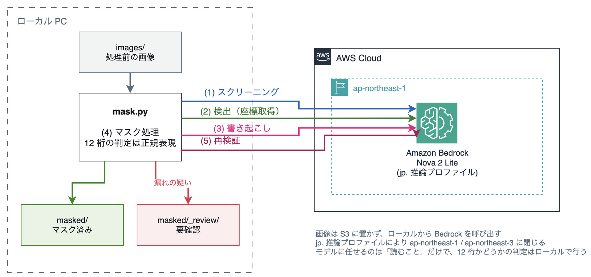

# nova2-image-credential-masker

画像に写り込んだ認証情報を Amazon Nova 2 Lite で検出し、マスクするローカル CLI ツールです。既定は黒塗りで、ぼかしも選べます。

フォルダ内の画像を一括処理します。AWS 上にリソースを作成しないため、画像を S3 にアップロードする必要がなく、放置によるコストも発生しません。

正規表現やキーワードの事前登録は不要です。Nova 2 Lite が画像を見て文脈から判断するため、日本語のスクリーンショットにも対応します。

## 仕組み



画像は S3 に置かず、ローカルから Bedrock を呼び出すだけの構成です。AWS 側に作成するリソースはありません。

画像 1 枚につき、以下の 4 ステップで処理します。

| ステップ | 処理 | 目的 |
|---|---|---|
| 1 スクリーニング | 認証情報の有無だけを判定 | 対象外の画像を早期に除外してコストを抑える |
| 2 検出 | 認証情報のバウンディングボックスを取得 | `[0, 1000]` 正規化座標で受け取る |
| 3 12 桁スキャン | テキストを文字起こしして、正規表現で 12 桁の数字を含む行を拾う | 判定をモデルに任せず確実に拾う |
| 4 マスク | Pillow で塗り潰し | 座標を実寸に変換し、パディングを付与する |
| 5 再検証 | マスク済み画像を再度チェック | 漏れがあれば `_review/` へ振り分ける |

検出結果は実行のたびに変動します。1 回の検出で全てを拾える保証はないため、ステップ 4 の再検証を用意しています。

### 12 桁の数字の扱い

アカウント ID のような 12 桁の数字は、長い識別子の中に埋め込まれていると検出プロンプトでは取りこぼすことがあります。`arn:aws:iam::123456789012:user/foo` のような文字列を、モデルが 1 つの識別子として扱い、その中の数字の並びを見ないためです。

そこで本ツールでは、判定をモデルに委ねていません。画像のテキストを文字起こししたうえで、**12 桁かどうかは正規表現で判定**します。該当した行は、値だけを切り出さずに**行ごとマスク**します。範囲は広くなりますが、確実に消せます。

このパスを省く場合は `--no-digit-scan` を指定してください（呼び出しが 1 回減ります）。

### 日本国内リージョンでの処理

既定のモデル ID は `jp.amazon.nova-2-lite-v1:0` です。

Nova 2 Lite はオンデマンド呼び出しに対応しておらず、推論プロファイル経由での呼び出しが必要です。`jp.` プレフィックスのプロファイルは `ap-northeast-1` と `ap-northeast-3` にのみルーティングされるため、処理を日本国内に閉じられます。

グローバルにルーティングする場合は `--model-id global.amazon.nova-2-lite-v1:0` を指定してください。

### マスク漏れの判定

再検証にマスク後の画像を渡すと、Nova は黒塗りの下にあったはずの値を文脈から推測し、「まだ読める」と報告することがあります。プロンプトで禁止しても解消しません。

このため本ツールでは、再検証にも座標を返させ、**報告された位置が黒塗り矩形の内側であれば推測とみなして無視**します。マスクがずれて実際に読めてしまっている場合は矩形の外側に出るため、そちらは漏れとして検知できます。

## 前提条件

- Python 3.9 以降
- Amazon Bedrock で Nova 2 Lite のモデルアクセスが有効になっていること
- 以下の権限を持つ AWS 認証情報

```json
{
  "Version": "2012-10-17",
  "Statement": [
    {
      "Effect": "Allow",
      "Action": "bedrock:InvokeModel",
      "Resource": [
        "arn:aws:bedrock:*:*:inference-profile/jp.amazon.nova-2-lite-v1:0",
        "arn:aws:bedrock:*::foundation-model/amazon.nova-2-lite-v1:0"
      ]
    }
  ]
}
```

推論プロファイル経由で呼び出すため、プロファイルと基盤モデルの両方に権限が必要です。

## セットアップ

```bash
git clone https://github.com/furuya02/nova2-image-credential-masker.git
cd nova2-image-credential-masker

python3 -m venv .venv
source .venv/bin/activate
pip install -r requirements.txt
```

## 動作確認

認証情報が写り込んだスクリーンショットを模したサンプル画像を生成します。値はすべてダミーです。

```bash
python samples/gen_samples.py --output ./images
```

生成した画像を一括処理します。

```bash
python mask.py --input ./images --output ./masked
```

実行結果の例です。

```
model=jp.amazon.nova-2-lite-v1:0 region=ap-northeast-1 images=2

  [OK] 01_console_ja.png  findings=5
  [!!] 02_terminal_en.png  findings=6
        残存の疑い: aws_account_id '123456789012'

マスク済み: 1  対象なし: 0  要確認: 1
  要確認の画像は masked/_review を目視してください
呼び出し 6 回 / 入力 3308 tok / 出力 701 tok
概算コスト $0.0036
```

`masked/` にマスク済みの画像が出力されます。再検証で漏れが疑われた画像は `masked/_review/` に振り分けられるので、目視で確認してください。

## オプション

| オプション | 既定値 | 説明 |
|---|---|---|
| `--input` | 必須 | 入力フォルダ |
| `--output` | 必須 | 出力フォルダ |
| `--style` | `black` | 隠し方（`black` = 黒塗り / `blur` = ガウスぼかし） |
| `--max-tokens` | `4000` | 検出・再検証の応答上限トークン数 |
| `--no-digit-scan` | - | 12 桁スキャンを省略する |
| `--padding-x` | `2.0` | 横方向のパディング（検出枠の高さに対する倍率） |
| `--padding-y` | `0.6` | 縦方向のパディング（同上） |
| `--region` | `ap-northeast-1` | リージョン |
| `--model-id` | `jp.amazon.nova-2-lite-v1:0` | モデル ID（推論プロファイル） |
| `--no-screen` | - | スクリーニングを省略し、全画像を検出にかける |
| `--no-verify` | - | マスク後の再検証を省略する |

### 隠し方について

`--style blur` を指定すると、黒塗りではなくガウスぼかしで隠します。

```bash
python mask.py --input ./images --output ./masked --style blur
```

ただし既定は `black` です。黒塗りは該当領域を単色で置き換えるため、隠すという目的に対して確実です。

認証情報を隠す用途では `black` を使用してください。`blur` は見た目を優先したい場合の選択肢です。

### パディングについて

検出枠は正解の文字位置に対してわずかにずれるため、パディングを付けて塗り潰します。

パディングは画像サイズではなく**検出枠の高さ**を基準にした倍率で指定します。文字サイズに追従するため、解像度の異なる画像でも同じ値を使えます。

既定値は、作者の環境で自作のサンプル画像 2 枚（12 箇所）を 5 回ずつ処理して測定した結果（不足は左端に偏り、左端で最大 1.24 倍、右端 0.21 倍、上下 0.00 倍）に、十分な余裕を加えたものです。隠し残しを避けることを優先しているため、周囲の文字も一緒に消えます。あくまで一例ですので、対象の画像によっては調整してください。

長い文字列に埋め込まれた値のように前後の文字が密着している箇所では、既定値でも隣接する数文字が一緒に黒塗りされます。周囲の可読性を優先する場合は `--padding-x` を下げてください。ただしマスク漏れのリスクは上がります。

### 応答を解析できない場合

Nova が指定どおりの形で返さないことがあります。とくに該当なしの場合、`{"remaining": []}` ではなく `[]` だけを返してくることがあるため、本ツールではオブジェクトと配列の両方を受け取れるようにしています。

それでも解析できなかった場合（応答が途中で切れた、JSON 以外が返ったなど）は、該当画像を `_review/` へ回したうえで理由を表示します。

```
[!!] 001.png  findings=0
      検出結果を解析できませんでした（--max-tokens の引き上げをお試しください）
```

`--max-tokens` を引き上げて再実行してください。

```bash
python mask.py --input ./images --output ./masked --max-tokens 8000
```

なお、1 枚の処理に失敗しても残りの画像は続けて処理します。失敗した画像は `_review/` に入りますので、そこだけ確認すれば済みます。

## コスト

AWS 上に常駐するリソースは作成しないため、放置によるコストは発生しません。発生するのは Bedrock の従量課金のみです。

1 画像あたり 4 回（スクリーニング / 検出 / 12 桁スキャン / 再検証）呼び出します。上記の実行例では 2 画像で $0.0036 でしたが、これは作者の環境でサンプル画像を処理した一例です。検出される項目が多い画像ほど出力トークンが増えますので、まず数枚で試して単価を把握することをおすすめします。

東京リージョンの Nova 2 Lite の単価は、入力 $0.396 / 1M トークン、出力 $3.311 / 1M トークンです（`aws pricing get-products --service-code AmazonBedrock` で取得した値）。

画像の入力トークンは、解像度によらず 1 枚あたり 230 トークンの固定で課金されます（[Multimodal understanding](https://docs.aws.amazon.com/nova/latest/nova2-userguide/using-multimodal-models.html)）。

Bedrock の料金表には `nova-grounding` という 1 リクエストあたり $0.03 の項目がありますが、これは [Web Grounding](https://docs.aws.amazon.com/nova/latest/nova2-userguide/web-grounding.html)（Nova が Web を検索して出典付きで回答する機能）に対する課金です。利用するには `toolConfig` で systemTool として明示的に指定する必要があり、本ツールは使用していないため課金されません。実行した翌日に Cost Explorer で確認しても、計上されていたのは入力・出力のトークン課金だけでした。

## 注意事項

検出は LLM の判断によるものであり、すべての認証情報を確実に検出できるわけではありません。実行のたびに結果が変動することも確認しています。

公開前の画像は、必ず目視で確認してください。本ツールは目視確認の負担を減らすものであり、置き換えるものではありません。

また、画像は解析のため Amazon Bedrock に送信されます。既定の `jp.` プロファイルであれば日本国内のリージョンに閉じますが、機密性の高い画像を処理する前に、それが許容される運用かをご確認ください。

## ライセンス

MIT License

## Contributing

Issue および Pull Request を歓迎します。
