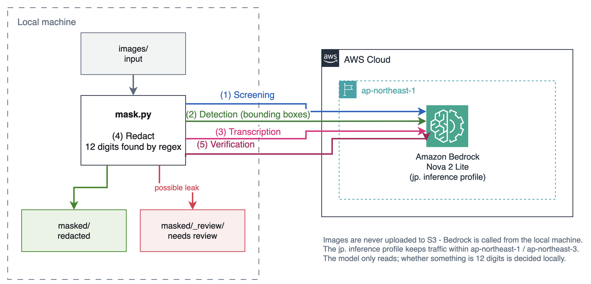

# nova2-image-credential-masker

A local CLI tool that detects credentials left visible in images and redacts them, using Amazon Nova 2 Lite. Solid boxes by default, blur if you prefer.

It processes a whole folder at once. Nothing is deployed to AWS, so images never have to be uploaded to S3 and there is no idle cost to worry about.

No regular expressions or keyword lists to maintain. Nova 2 Lite reads the image and decides from context, so Japanese screenshots work as well as English ones.

## How it works



Images stay on your machine — Bedrock is called directly, and nothing is created on the AWS side.

Each image goes through four steps.

| Step | What it does | Why |
|---|---|---|
| 1 Screening | Decides only whether credentials are present | Skips irrelevant images early to keep cost down |
| 2 Detection | Gets a bounding box for each credential | Returned in the normalized `[0, 1000]` space |
| 3 Digit scan | Transcribes the text and finds 12-digit runs with a regex | Keeps the judgement out of the model |
| 4 Redaction | Paints over the text with Pillow | Converts coordinates to pixels and adds padding |
| 5 Verification | Re-checks the redacted image | Moves anything suspicious to `_review/` |

Detection results vary between runs. A single detection pass is not guaranteed to catch everything, which is what step 4 is for.

### How 12-digit numbers are handled

A 12-digit number embedded in a longer identifier tends to slip past detection. Asked to find it, the model treats `arn:aws:iam::123456789012:user/foo` as a single identifier and never looks at the digits inside.

So the judgement does not sit with the model. The image is transcribed, and **a regex decides what counts as 12 digits**. Matching lines are redacted whole rather than trimmed to the value — a wider box, but a reliable one.

Pass `--no-digit-scan` to skip this pass and save one call.

### Keeping processing inside Japan

The default model ID is `jp.amazon.nova-2-lite-v1:0`.

Nova 2 Lite does not support on-demand invocation, so it must be called through an inference profile. The `jp.` profile routes only to `ap-northeast-1` and `ap-northeast-3`, which keeps processing within Japan.

To route globally, pass `--model-id global.amazon.nova-2-lite-v1:0`.

### Deciding what was actually missed

When the redacted image is sent back for verification, Nova sometimes infers the value that used to be under a black box and reports it as "still readable". Forbidding this in the prompt does not stop it.

So this tool asks the verification step for coordinates as well, and **ignores any report whose position falls inside a black box**, treating it as a guess. If a box is misaligned and a value really is legible, it falls outside the box and is correctly flagged.

## Requirements

- Python 3.9 or later
- Model access to Nova 2 Lite enabled in Amazon Bedrock
- AWS credentials with the following permissions

```json
{
  "Version": "2012-10-17",
  "Statement": [
    {
      "Effect": "Allow",
      "Action": "bedrock:InvokeModel",
      "Resource": [
        "arn:aws:bedrock:*:*:inference-profile/jp.amazon.nova-2-lite-v1:0",
        "arn:aws:bedrock:*::foundation-model/amazon.nova-2-lite-v1:0"
      ]
    }
  ]
}
```

Both the inference profile and the foundation model need to be allowed, since the call goes through the profile.

## Setup

```bash
git clone https://github.com/furuya02/nova2-image-credential-masker.git
cd nova2-image-credential-masker

python3 -m venv .venv
source .venv/bin/activate
pip install -r requirements.txt
```

## Try it

Generate sample images that imitate screenshots with credentials left visible. All values are dummies.

```bash
python samples/gen_samples.py --output ./images
```

Process the folder.

```bash
python mask.py --input ./images --output ./masked
```

Example output.

```
model=jp.amazon.nova-2-lite-v1:0 region=ap-northeast-1 images=2

  [OK] 01_console_ja.png  findings=5
  [!!] 02_terminal_en.png  findings=6
        残存の疑い: aws_account_id '123456789012'

マスク済み: 1  対象なし: 0  要確認: 1
  要確認の画像は masked/_review を目視してください
呼び出し 6 回 / 入力 3308 tok / 出力 701 tok
概算コスト $0.0036
```

Redacted images are written to `masked/`. Anything the verification step flagged is moved to `masked/_review/` for you to check by eye.

## Options

| Option | Default | Description |
|---|---|---|
| `--input` | required | Input folder |
| `--output` | required | Output folder |
| `--style` | `black` | How to hide values (`black` = solid box, `blur` = Gaussian blur) |
| `--max-tokens` | `4000` | Response token limit for detection and verification |
| `--no-digit-scan` | - | Skip the 12-digit scan |
| `--padding-x` | `2.0` | Horizontal padding, as a multiple of the detected box height |
| `--padding-y` | `0.6` | Vertical padding, same unit |
| `--region` | `ap-northeast-1` | Region |
| `--model-id` | `jp.amazon.nova-2-lite-v1:0` | Model ID (inference profile) |
| `--no-screen` | - | Skip screening and run detection on every image |
| `--no-verify` | - | Skip verification of the redacted image |

### About the redaction style

Pass `--style blur` to hide values with a Gaussian blur instead of a solid box.

```bash
python mask.py --input ./images --output ./masked --style blur
```

The default is `black`. Painting the region a solid colour replaces what was there, which is the more certain way to hide it.

Use `black` for credentials. `blur` is there for when appearance matters more than certainty.

### About padding

Detected boxes sit slightly off from the actual text, so padding is added before painting.

Padding is expressed as a multiple of the **detected box height** rather than the image size. Because it follows the text size, the same value works across images of different resolutions.

The defaults come from processing two sample images (12 regions) five times each on the author's machine, plus some margin. Shortfall skewed to the left edge: 1.24x the text height on the left, 0.21x on the right, and 0.00x top and bottom. Treat that as one data point; your own images may need different values.

Where characters sit flush against the value — a number embedded in a longer string, say — the default will also cover a few neighbouring characters. Lower `--padding-x` if the surrounding text matters more to you, at the cost of a higher chance of missing part of a value.

### When the response cannot be parsed

Nova does not always answer in the exact shape the prompt asks for. With nothing to report it may return just `[]` instead of `{"remaining": []}`, so this tool accepts both an object and a bare array.

If the response still cannot be parsed — cut off by the token limit, or not JSON at all — the image is moved to `_review/` and the reason is printed.

```
[!!] 001.png  findings=0
      検出結果を解析できませんでした（--max-tokens の引き上げをお試しください）
```

Raise the limit and run again.

```bash
python mask.py --input ./images --output ./masked --max-tokens 8000
```

A failure on one image does not stop the rest of the folder — the image lands in `_review/` and processing continues.

## Cost

Nothing runs continuously on AWS, so there is no idle cost. The only charge is Bedrock usage.

Each image costs four calls (screening / detection / digit scan / verification). The run above came to $0.0036 for two images, measured on the author's machine — images with more findings produce more output tokens, so run a few first to get a feel for your own per-image cost.

Nova 2 Lite in the Tokyo region is priced at $0.396 per 1M input tokens and $3.311 per 1M output tokens (values retrieved with `aws pricing get-products --service-code AmazonBedrock`).

Image input is billed at a flat 230 tokens per image regardless of resolution ([Multimodal understanding](https://docs.aws.amazon.com/nova/latest/nova2-userguide/using-multimodal-models.html)).

The Bedrock price list also contains a `nova-grounding` item at $0.03 per request, but that covers [Web Grounding](https://docs.aws.amazon.com/nova/latest/nova2-userguide/web-grounding.html) — the feature that lets Nova search the web and answer with citations. It has to be requested explicitly as a systemTool in `toolConfig`, which this tool never does, so it is not charged here — checking Cost Explorer the day after a run showed input and output token charges only.

## Caveats

Detection relies on the model's judgement and will not catch every credential. Results have been observed to vary between runs on the same image.

Always review images by eye before publishing them. This tool is meant to reduce that work, not to replace it.

Note that images are sent to Amazon Bedrock for analysis. With the default `jp.` profile this stays within Japanese regions, but confirm it is acceptable for your data before pointing the tool at sensitive material.

## License

MIT License

## Contributing

Issues and pull requests are welcome.
